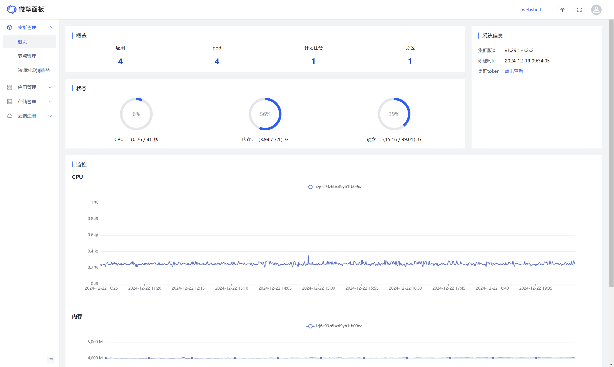
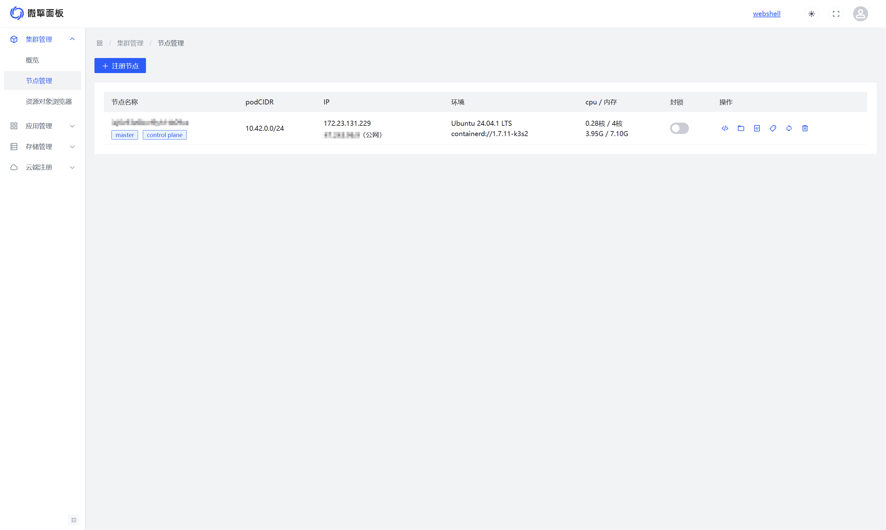
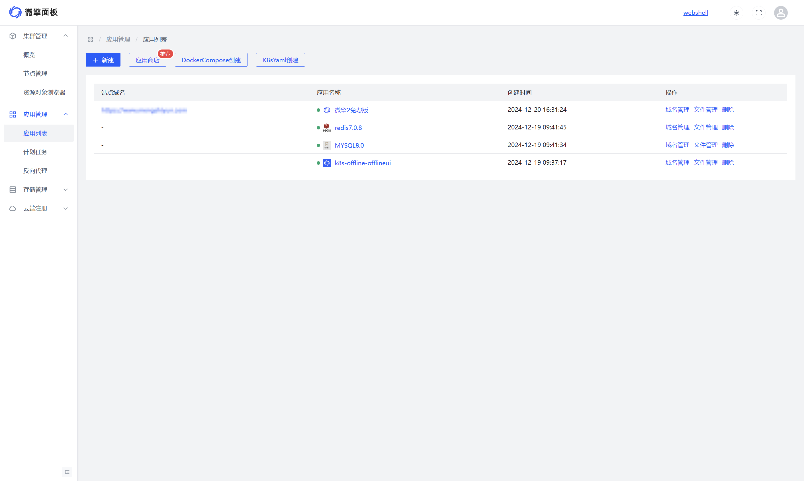
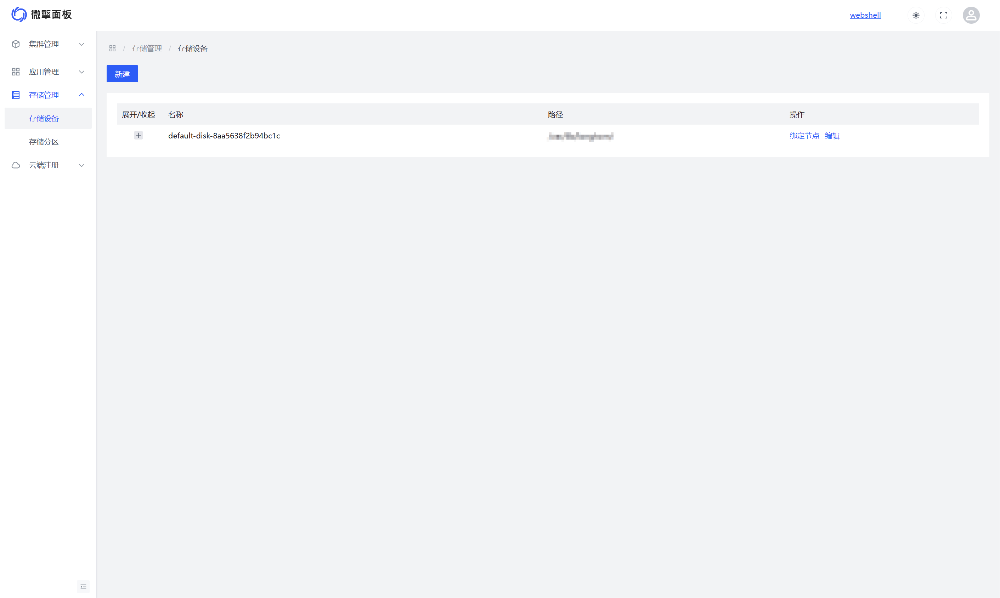
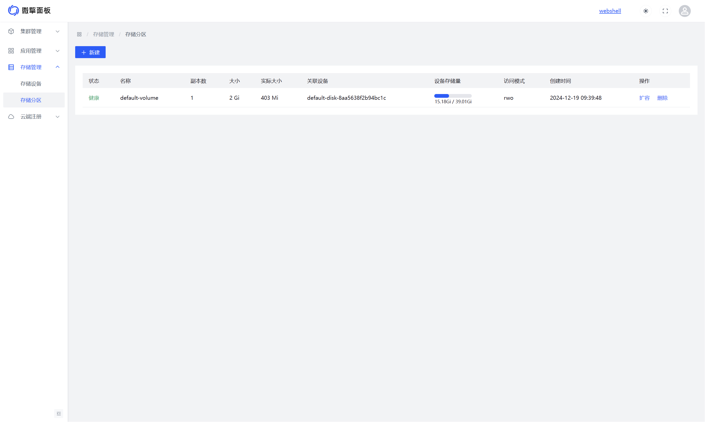
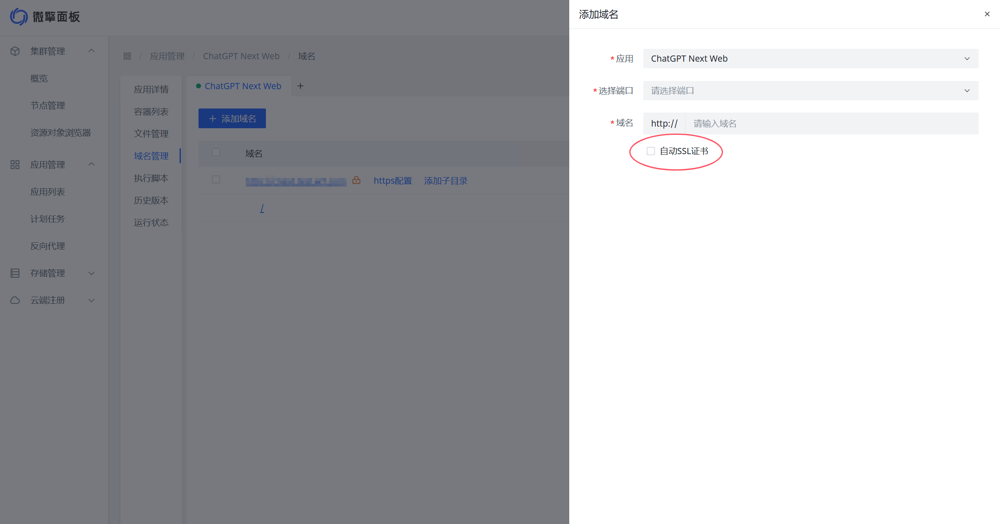

<h1 align="center">
    
    <br>
</h1>

**微擎面板（w7panel）** 是一款基于 Kubernetes 的云原生控制面板。它由微擎团队结合多年运维经验持续打磨，目标是把原本偏底层、偏复杂的云原生能力，整理成更适合日常业务落地和服务器管理的可视化操作体验。

## 项目简介

W7Panel 提供统一的集群、应用、文件、域名、存储与用户管理能力，适合个人开发者、中小团队和需要私有化部署的场景。用户不必熟悉复杂的 `kubectl` 命令，也可以完成应用部署、资源管理和日常运维。

### 核心特性

- **可视化集群管理**：实时查看节点、资源对象和系统运行状态
- **一键应用部署**：支持应用商店、Docker Compose、Helm、YAML 等多种部署方式
- **在线文件管理**：支持 WebDAV、在线编辑、压缩解压、权限修改等操作
- **内置 Web IDE**：基于 Codeblitz/OpenSumi 提供在线代码编辑能力
- **灵活域名管理**：支持域名绑定与 Let's Encrypt 自动 HTTPS 证书
- **持久化存储能力**：支持 Longhorn、NFS、Local 等多种存储方案

### 技术架构

| 组件 | 技术栈 | 说明 |
|------|--------|------|
| 后端 | Go 1.24 + Gin + w7-rangine-go | RESTful API、WebDAV 代理、K8S 交互 |
| 前端 | Vue 3.5 + TypeScript + Arco Design | 响应式管理界面 |
| Web IDE | React + Codeblitz (OpenSumi) | 在线代码编辑器 |
| 容器运行时 | containerd / Docker | 兼容主流容器运行时 |
| 存储 | Longhorn / NFS / Local | 多种存储后端支持 |

### 适用场景

- **个人开发者**：快速部署和管理个人项目
- **中小企业**：降低 K8S 运维门槛，统一管理业务环境
- **开发团队**：提供统一的开发、测试、部署入口
- **私有化部署场景**：支持离线环境和自主可控的数据管理

## 环境要求

- 节点服务器配置 >= 2核4G
- 支持主流 Linux 发行版，推荐 CentOS Stream >= 9 或 Ubuntu Server >= 22
- 需保证服务器外网端口 `6443`、`80`、`443`、`9090` 可访问
- 建议使用全新的服务器环境安装，避免与其他面板系统混用
- 浏览器建议使用 Chrome、Firefox、Edge 等现代浏览器

## 安装部署

```bash
curl -sfL https://cdn.w7.cc/w7panel/install.sh | sh -
```

安装完成后，首次进入后台 `http://{ip}:9090`，可设置管理员账号密码。

## 开发模式快速开始

```bash
# 设置环境变量
export BASE_DIR=/home/wwwroot/w7panel-dev

# 开发模式启动（需要 kubeconfig.yaml）
cd $BASE_DIR/dist
export KUBECONFIG=$BASE_DIR/kubeconfig.yaml
./w7panel-ctl.sh start

# 默认访问
# http://localhost:8080/
# 用户名: admin
# 密码: 123456
```

## 核心优势

- **生产等级**
  
  由微擎团队多年运维实践沉淀而来，经过内部业务和真实用户场景反复验证，目标不是演示型面板，而是能真正落地的生产级管理系统。

- **简单易用**
  
  系统对云原生底层概念做了抽象和整理，让用户可以沿用传统面板的使用习惯，同时获得 K8S 带来的部署效率与高可用能力。

- **应用生态**
  
  提供应用包、依赖配置、应用商店等能力，既方便开发者打包，也降低用户安装和管理应用时的复杂度。

## 功能概览

### 集群管理

- 概览仪表盘：CPU、内存、硬盘、节点、应用、域名等实时统计
- 节点管理：节点注册、镜像源配置、内存优化、节点封锁/驱逐
- 资源对象浏览器：浏览 Pod、Service、ConfigMap、Secret 等 K8S 资源
- 集群终端、配置字典、密钥管理、证书管理等基础运维能力

### 应用管理

- 应用列表、应用商店、Helm 应用、Docker Compose、YAML 创建
- 代码包部署、计划任务、反向代理、集群数据库、AI 应用管理

### 应用详情能力

- 应用信息、容器列表、文件管理、域名管理
- 运行状态监控、事件日志、历史版本、执行脚本

### 存储与制品管理

- 存储设备、存储分区、Longhorn 管理
- ZPK 制品、传统应用、镜像构建、Helm 生成

### 系统与用户管理

- 云配置、API 密钥、许可证、权限策略、订单中心、费用中心
- 用户列表、用户组、资源配额、白名单等权限与资源管理能力

### 其他能力

- K3S 优化、KubeBlocks、GPU 管理、DNS 工具、连接测试

## 界面预览

- **支持多节点**
  
  基于 K8S 的集群能力，W7Panel 可管理多节点环境，在流量增长时更容易完成扩容和负载分摊。
  
  
  
  

- **支持多种应用类型**
  
  支持镜像、Compose、YAML、Helm、应用商店等多种交付方式。
  
  

- **支持分布式存储**
  
  提供更贴近日常运维习惯的存储管理能力。

  
  
  

- **免费 HTTPS 证书**
  
  支持自动签发和续期，减少证书维护成本。

  

## 文档导航

### 用户文档

- [快速入门](./docs/user-guide/README.md)
- [集群管理](./docs/user-guide/cluster-management.md)
- [应用管理](./docs/user-guide/app-management.md)
- [文件管理](./docs/user-guide/file-management.md)
- [存储管理](./docs/user-guide/storage-management.md)
- [域名管理](./docs/user-guide/domain-management.md)
- [常见问题](./docs/user-guide/faq.md)

### 开发与部署文档

- [API 文档](./docs/api/README.md)
- [部署文档](./docs/deployment/README.md)
- [部署排障](./docs/deployment/troubleshooting.md)
- [开发指南](./docs/development/README.md)
- [测试文档](./docs/testing/README.md)
- [版本日志](./docs/changelog/1.0.0.md)

### 子项目说明

- `w7panel/`：后端源码
- `w7panel-ui/`：前端源码
- `codeblitz/`：Web IDE 源码
- `tests/`：测试脚本与测试资料

## 常见问题

- 如果出网使用了 NAT 网关，导致获取公网 IP 不正确，可在安装时指定 `PUBLIC_IP`：
  
  ```bash
  PUBLIC_IP=123.123.123.123 sh install.sh
  ```

- 如果忘记密码，可在 master 服务器执行以下命令重置管理员账号密码：
  
  ```bash
  kubectl exec -it $(kubectl get pods -n default -l app=w7panel-offline | awk 'NR>1{print $1}') -- ko-app/k8s-offline auth:register --username=admin --password=123456
  ```

- 如果公网 IP 和内网 IP 使用 IPv6，可能导致网络组件安装错误。建议关闭 IPv6，或在安装时显式指定 `PUBLIC_IP` 与 `INTERNAL_IP`：
  
  ```bash
  PUBLIC_IP=123.123.123.123 INTERNAL_IP=123.123.123.123 sh install.sh
  ```

- 多节点集群下，如果 Server 节点 IP 变更导致 Agent 无法通信，可检查节点状态、修正 `/etc/systemd/system/k3s-agent.service.env` 中的 `K3S_URL`，然后执行：
  
  ```bash
  systemctl restart k3s-agent
  ```

- 如果安装时长期卡在等待步骤，尤其在非大陆地区服务器上，可能是镜像拉取较慢。可先中断等待，调整 `/etc/rancher/k3s/registries.yaml`，然后重启 `k3s.service` 后继续观察 Pod 启动情况。

更完整的安装、运维与故障处理说明，请查看 [部署排障文档](./docs/deployment/troubleshooting.md) 与 [docs/](./docs/README.md) 下各专题文档。

## 社区

**微信群**


