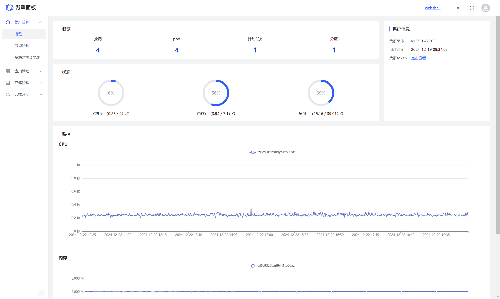
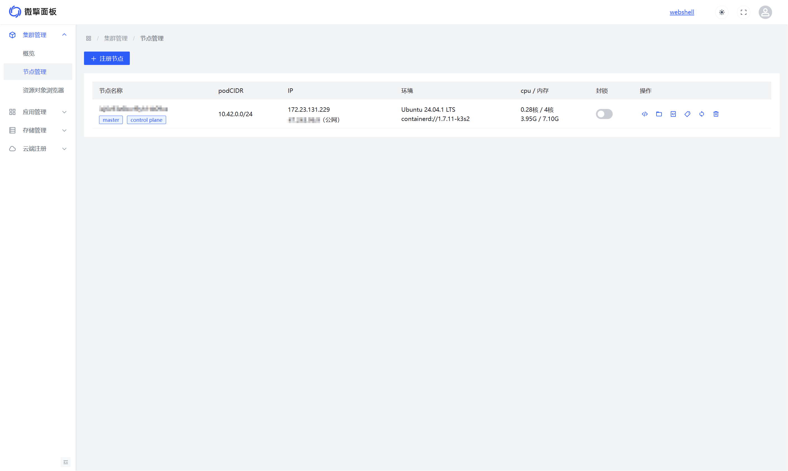
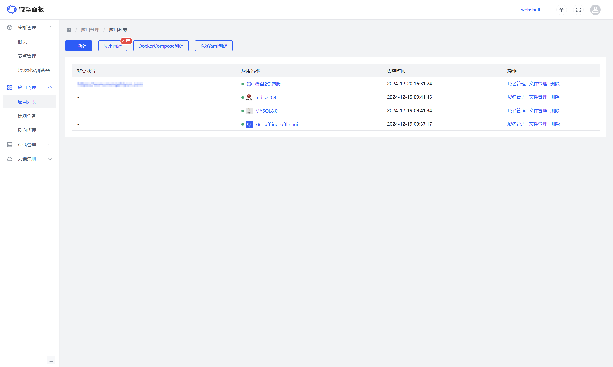
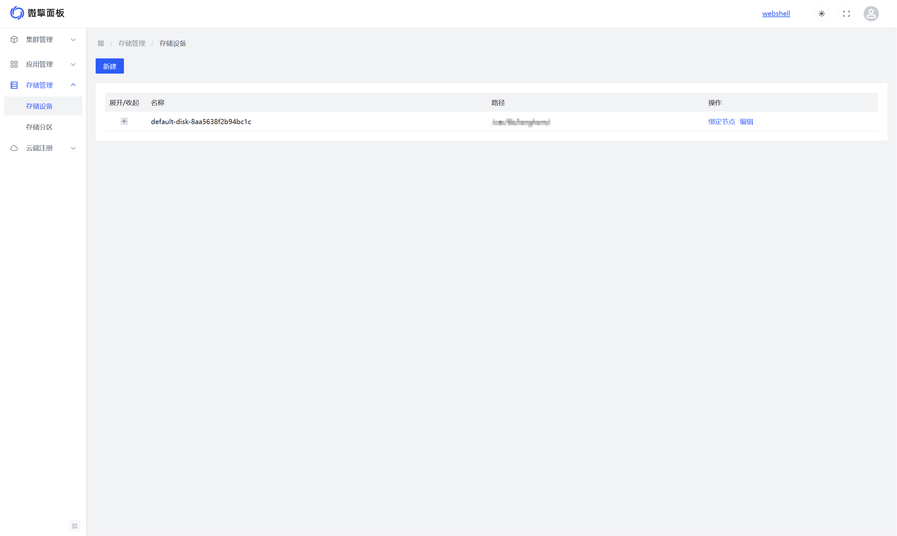
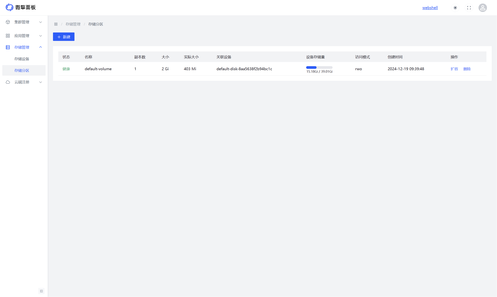
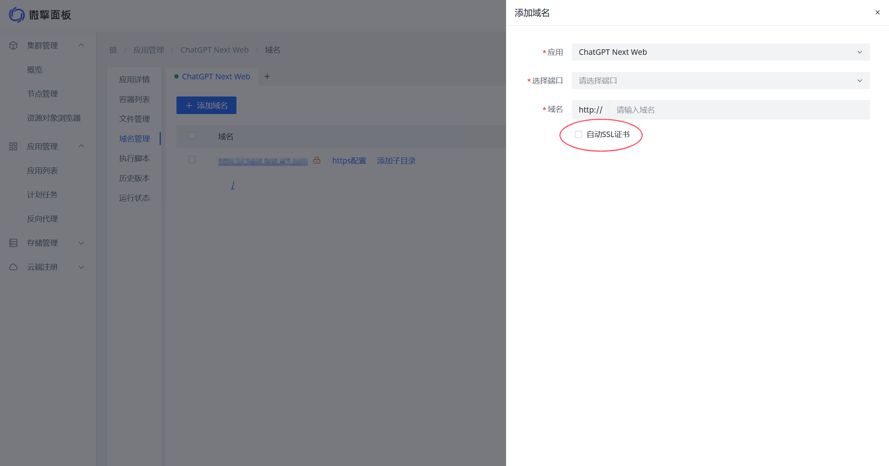

<h1 align="center">
    
    <br>
</h1>

<p align="center">
  <strong>微擎面板（W7Panel）</strong> 是一套面向 Kubernetes 场景的云原生应用管理平台，帮助个人开发者、中小团队和私有化部署用户，用更直观的方式完成应用部署、接入、维护和排查。
</p>

<p align="center">
  <a href="./docs/src/user-guide/quick-start.md">快速开始</a> ·
  <a href="./docs/README.md">文档中心</a> ·
  <a href="./docs/src/development/index.md">开发指南</a> ·
  <a href="./docs/src/user-guide/overview/faq.md">FAQ</a>
</p>

## 项目定位

W7Panel 不是脱离 Kubernetes 的通用服务器面板，而是围绕云原生应用全生命周期设计的统一控制台。它把原本分散在 `kubectl`、配置文件、日志、Ingress、存储和多套工具里的日常工作，收拢到更适合高频使用的可视化界面中。

你可以把它理解为一条连续链路：先接入并查看运行环境，再创建和交付应用，然后配置访问方式，接着维护文件、域名和存储，最后在运行过程中持续查看状态、处理问题和做日常运维。

## 核心能力

| 能力 | 说明 |
|------|------|
| 集群与节点管理 | 查看集群概览、节点状态、资源对象、配置字典、密钥、证书、终端和诊断信息 |
| 应用交付 | 支持应用商店、镜像、Docker Compose、Helm、YAML、代码包和 ZPK 制品等多种交付方式 |
| MicroApp 机制 | 基于 Wujie 将扩展应用能力融合进面板控制台，便于统一入口和权限边界 |
| 文件管理 | 通过 WebDAV 支持容器文件浏览、上传下载、在线编辑、压缩解压和权限调整 |
| 域名与访问入口 | 支持域名绑定、反向代理、私有 DNS、连接诊断和 Let's Encrypt HTTPS 证书 |
| 存储与镜像 | 支持存储设备、存储分区、Longhorn、本地镜像管理、镜像仓库缓存和镜像构建 |
| 运维排查 | 查看日志、事件、运行状态、资源指标、计划任务和节点侧运维能力 |

## 适用场景

- **个人开发者**：快速部署和管理个人项目，不必把所有操作都放在命令行里完成。
- **中小团队**：统一应用、文件、域名、存储和日常运维入口，降低 Kubernetes 使用门槛。
- **运维或平台团队**：为研发、测试或业务侧提供更可控、更低门槛的 Kubernetes 操作界面。
- **私有化部署场景**：在自有服务器或内网环境中掌控应用、数据和运行环境。

## 技术架构

| 组件 | 技术栈 | 说明 |
|------|--------|------|
| 后端 | Go 1.26 + Gin + w7-rangine-go | RESTful API、WebDAV、K8s 交互、代理和后台服务 |
| 前端 | Vue 3 + TypeScript + Arco Design | 管理端界面、API 调用、微应用容器和可复用组件 |
| 文档站 | VitePress | 用户手册、开发指南、API 文档、性能规范和版本记录 |
| Helm Chart | charts/w7panel | Kubernetes 部署资源模板 |

## 安装部署

### 环境要求

安装前请确认服务器满足以下条件：

- 节点服务器配置不低于 **2 核 4G**
- 支持主流 Linux 发行版，推荐 **CentOS Stream 9+** 或 **Ubuntu Server 22+**
- 服务器外网端口 **6443、80、443、9090** 可访问
- 建议使用全新的服务器环境安装，不建议与其他面板系统混用
- 浏览器建议使用 Chrome、Firefox、Edge 等现代浏览器

### 一键安装

```bash
curl -sfL https://cdn.w7.cc/w7panel/install.sh | sh -
```

安装完成后，通过下面地址进入后台：

```text
http://{ip}:9090
```

其中 `{ip}` 替换为服务器公网 IP 或可访问地址。首次进入后台后，可以设置管理员账号和密码。

更多安装前检查、首次进入后台和无法访问后台的排查步骤，请查看 [快速开始](./docs/src/user-guide/quick-start.md)。

## 开发快速开始

每次开发前先同步 `dev-v1`：

```bash
git fetch origin dev-v1
git pull origin dev-v1
```

无特别要求时，部署测试使用测试模式：

```bash
export LOCAL_MOCK=true
export CAPTCHA_ENABLED=false
export KUBECONFIG=$BASE_DIR/kubeconfig.yaml
```

后端构建与测试：

```bash
cd $BASE_DIR/w7panel-server
mkdir -p $BASE_DIR/dist
go build -o $BASE_DIR/dist/w7panel .
go test ./...
```

前端开发与构建：

```bash
cd $BASE_DIR/w7panel-ui
npm run dev
npm run build
```

启动服务优先使用启动脚本：

```bash
cd $BASE_DIR/dist
export LOCAL_MOCK=true
export CAPTCHA_ENABLED=false
export KUBECONFIG=$BASE_DIR/kubeconfig.yaml
./w7panel-ctl.sh start
```

如果当前 `dist/` 只有手动编译出的二进制、还没有复制启动脚本，可以直接启动：

```bash
cd $BASE_DIR/dist
export LOCAL_MOCK=true
export CAPTCHA_ENABLED=false
export KUBECONFIG=$BASE_DIR/kubeconfig.yaml
export KO_DATA_PATH=$BASE_DIR/w7panel-server/kodata
./w7panel server:start
```

停止服务优先使用：

```bash
./w7panel-ctl.sh stop
```

不要直接使用 `pkill -9` 或 `kill -9` 停止服务，避免子进程无法优雅退出。完整开发规范请查看 [开发指南](./docs/src/development/index.md)。

## 仓库结构

```text
.
├── w7panel-server/                  # 后端源码，Go 1.26 + Gin + w7-rangine-go
│   ├── app/                         # 后端应用模块
│   ├── common/                      # 公共服务、中间件和工具
│   ├── kodata/                      # 后端静态资源、CRD 和内置 Chart
│   └── install/                     # 安装相关资源
├── w7panel-ui/                      # 前端源码，Vue 3 + TypeScript + Arco Design
│   ├── src/api/                     # API 调用封装
│   ├── src/components/              # 公共组件
│   ├── src/hooks/                   # 复用逻辑
│   ├── src/router/                  # 路由配置
│   └── src/views/                   # 页面模块
├── charts/w7panel/                  # 当前维护的 Helm Chart
├── installer/                       # 安装脚本、离线清单和系统配置
├── docs/                            # VitePress 文档站源码
└── tests/                           # 测试脚本和测试资料
```

## 功能地图

### 用户指南

| 分类 | 文档 |
|------|------|
| 概述 | [微擎面板是什么](./docs/src/user-guide/index.md)、[版本日志](./docs/src/user-guide/overview/changelog/1.0.0.md)、[FAQ](./docs/src/user-guide/overview/faq.md) |
| 入门 | [快速开始](./docs/src/user-guide/quick-start.md) |
| 应用与交付 | [应用管理](./docs/src/user-guide/app-management.md)、[计划任务](./docs/src/user-guide/scheduled-tasks.md) |
| 集群与节点 | [集群管理](./docs/src/user-guide/cluster-management.md)、[镜像管理](./docs/src/user-guide/image-management.md) |
| 文件与存储 | [文件管理](./docs/src/user-guide/file-management.md)、[存储管理](./docs/src/user-guide/storage-management.md) |
| 访问与网络 | [域名管理](./docs/src/user-guide/domain-management.md)、[反向代理](./docs/src/user-guide/reverse-proxy.md)、[私有 DNS 解析](./docs/src/user-guide/private-dns.md) |
| 官方应用 | [站点管理](./docs/src/user-guide/site-management.md)、[制品开发](./docs/src/user-guide/zpk-development.md)、[CDN 文件缓存](./docs/src/user-guide/cdn-cache.md)、[镜像仓库缓存](./docs/src/user-guide/registry-cache.md) |

### 开发文档

| 分类 | 文档 |
|------|------|
| 总览 | [开发指南](./docs/src/development/index.md)、[性能规范总览](./docs/src/development/performance/index.md) |
| 后端 API | [API 说明](./docs/src/development/api/index.md)、[开发约定](./docs/src/development/api/conventions.md)、[调用凭据](./docs/src/development/api/credentials.md)、[OAuth/OIDC](./docs/src/development/api/oauth-oidc.md)、[Hawk 签名认证](./docs/src/development/api/hawk.md) |
| 集群 API | [集群资源](./docs/src/development/api/cluster-ops.md)、[存储](./docs/src/development/api/longhorn.md)、[文件管理](./docs/src/development/api/container-files.md)、[镜像管理](./docs/src/development/api/container-images.md)、[集群指标](./docs/src/development/api/metrics.md) |
| 业务 API | [微应用](./docs/src/development/api/microapp-static.md)、[Audit](./docs/src/development/api/audit.md)、[制品库应用管理](./docs/src/development/api/zpk.md)、[云主机](./docs/src/development/api/k3k.md)、[订单与超卖](./docs/src/development/api/orders.md) |
| 前端 | [前端说明](./docs/src/development/frontend/index.md)、[前端开发约定](./docs/src/development/frontend/conventions.md)、[调用凭据](./docs/src/development/frontend/auth-state.md)、[组件文档](./docs/src/development/frontend/components.md)、[Wujie 事件](./docs/src/development/frontend/wujie-events.md)、[微应用接入](./docs/src/development/frontend/microapps.md) |
| 示例 | [应用开发示例](./docs/src/development/examples/index.md)、[制品库操作示例](./docs/src/development/examples/zpk-product-workflow.md) |

## 界面预览

### 多节点管理

基于 Kubernetes 的集群能力，W7Panel 可管理多节点环境，在流量增长时更容易完成扩容和负载分摊。





### 多种应用类型

支持镜像、Compose、YAML、Helm、应用商店等多种交付方式。



### 分布式存储

提供更贴近日常运维习惯的存储管理能力。





### 免费 HTTPS 证书

支持自动签发和续期，减少证书维护成本。



## 常见问题速查

### W7Panel 一定要配合 Kubernetes 使用吗？

是的。W7Panel 的核心定位就是 Kubernetes 场景下的云原生应用管理平台。如果完全不使用 Kubernetes，它并不是为这类环境设计的。

### 不会 `kubectl` 还能使用吗？

可以。W7Panel 的目标之一就是降低 Kubernetes 的使用门槛。你可以通过界面完成应用部署、运行状态查看、日志事件排查、域名证书配置、文件管理和存储查看等常见操作。

### 自动识别的公网 IP 不正确怎么办？

如果服务器通过 NAT 出网，安装时可以显式指定公网 IP：

```bash
PUBLIC_IP=123.123.123.123 sh install.sh
```

### IPv6 影响安装或访问怎么办？

建议优先使用 IPv4 安装，必要时显式指定公网 IP 和内网 IP：

```bash
PUBLIC_IP=123.123.123.123 INTERNAL_IP=123.123.123.123 sh install.sh
```

### 忘记管理员密码怎么办？

可以在 master 节点重新注册管理员账号密码：

```bash
kubectl exec -it $(kubectl get pods -n default -l app=w7panel-offline | awk 'NR>1{print $1}') -- k8s-offline auth:register --username=admin --password=123456
```

更多问题请查看 [FAQ](./docs/src/user-guide/overview/faq.md)。

## 文档站

`docs/` 是 VitePress 文档站源码目录，主入口位于 [docs/src/index.md](./docs/src/index.md)。

本地预览：

```bash
cd docs
pnpm install
pnpm run dev
```

构建静态站点：

```bash
cd docs
pnpm run build
```

## 社区

**微信群**


